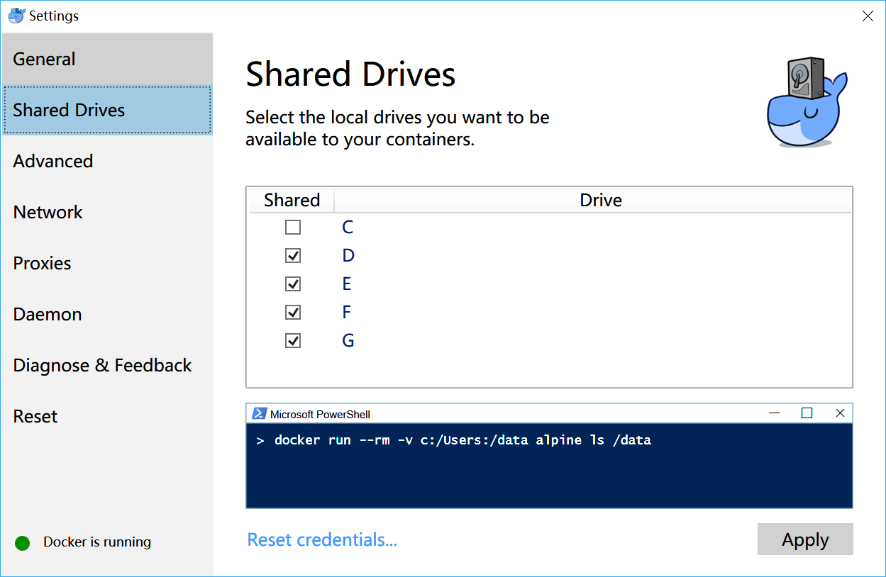
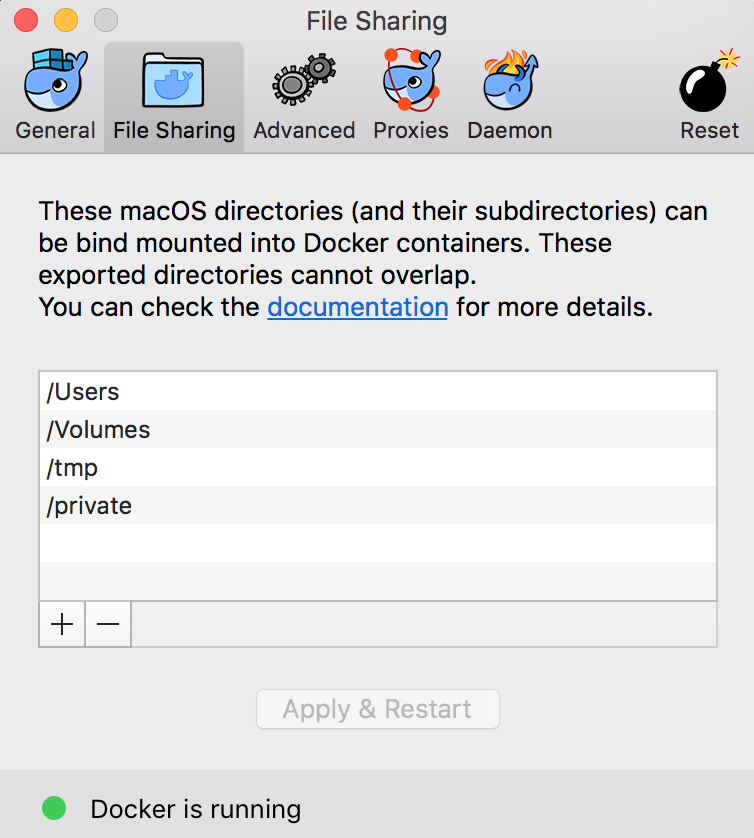
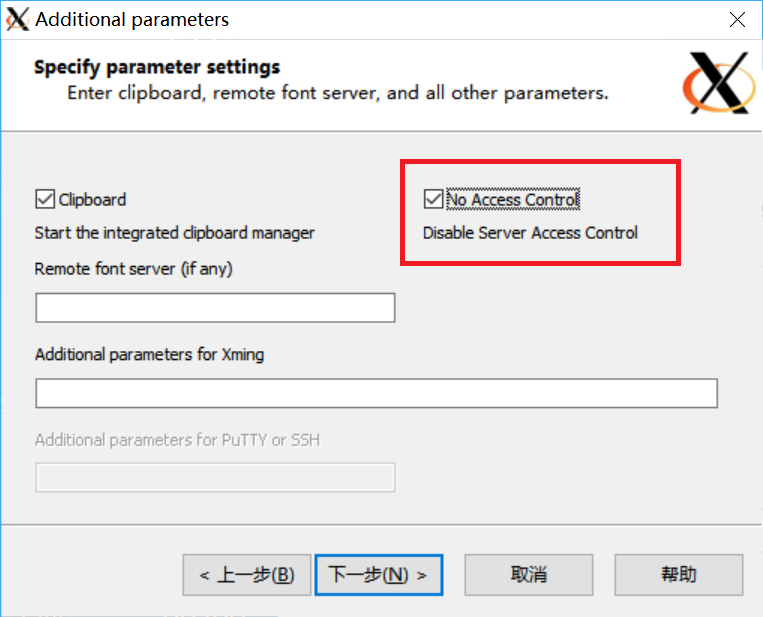

# Use docker and X11 forwarding to develop and test ucore_os

## Docker

### Download and install docker

#### Official Website

Follow the Guide of [docker official website](http://www.docker.com) to get docker for your own operating system.

#### For China Region

However, if you are in China, downloading from official website is NOT A GOOD WAY because of GFW. A much more recommended method is to use [Daocloud Docker Download Channel](http://get.daocloud.io).

*Attention: *

- Be sure to use China docker mirror to accelerate docker while you are in China region, more details can see [Daocloud Docker Accecelerator](https://www.daocloud.io/mirror). For using docker accelerator, you need to sign up an account in daocloud's website. However, it's worth it since the accelerator is free forever after your signing up.
- Your version of  Docker for Mac must higher then 17.06

### Volume configuration for docker in Windows and MacOS

#### Windows

Open the Settings of Docker for Windows, go to 'Shared Drives' tab, make sure your projects' root drive is in the shared drives list as below:



#### MacOS

Open the Preferences of Docker for Mac, make sure your projects' root folder and `/tmp` are both in the File sharing list as below:




## Prerequirements

### Linux

You'll need to allow the xhost access by using `xhost + loacl:root`

### MacOS

For receive X11 forwarding, You’ll need [XQuartz](https://www.xquartz.org/), and normally you would probably install it via [brew](http://brew.sh/) (but not this time):

```
$ brew cask install xquartz
```

XQuartz 2.7.11 is recommended, while XQuartz 2.7.9, which is the current one provided by brew, has a bug which will prevent you from following this guide.

After installing XQuartz, log out and back in to OS X.

Run XQuartz in e.g. bash:

```
open -a XQuartz

```

In the XQuartz preferences, go to the “Security” tab and make sure you’ve got “Allow connections from network clients” ticked:


The last work is to allow xhost access to localhost as below:

```
$ xhost + localhost
localhost being added to access control list
```

After doing this, type `xhost`, you will see the display below, which means the settings is successful:

```
$ xhost
access control enabled, only authorized clients can connect
INET:localhost
INET6:localhost
```

### Windows

You will need to install an X server for Windows. I went for [Vcxsrv](https://sourceforge.net/projects/vcxsrv/) and [Xming](https://sourceforge.net/projects/xming/). The `DISPLAY` environment variable points by default to 10.0.75.1:0.0. If you use docker on Windows 10, this should be ok.

I found Xming has better performance than Vcxsrv, so next is a tutorial of Xming.

after fully installing Xming, open `XLaunch.exe`, follow the default steps until the 'Specify parameter settings'. You should choose 'No Access Control' as below:




## How to use

### Initial
Firstly, you should build `ucore` image and run `ucore-container` container by using

```
$ make init
```

This operation can only be used once unless you change the `Dockerfile`.

use `docker ps` you can see a docker container called `ucore-container`.

### Attach

You'll use

```
$ make exec
```

to attach and enter the container. So the environment is ok, you can use this as a virtual machine to develop and test ucore_os.

By detach the container, just type `exit`. While you want to go back into the container, also type `make exec`.


### Start and stop

After `make init`, the `ucore-container` container has been established and will persist until you call `make rm` to remove the container. Even if you shut off your computer, the container is also existed. After your restarting you computer, by attaching the container, you need firstly to start it by using

```
$ make start
```

For stopping the container, just type

```
$ make stop
```

### Remove the container

For removing the `ucore-container` to initial a new `ucore-container`, just type

```
$ make rm
```

Make sure the container is stopped while you will remove it.

That's it, so concise and elegant.


## Some Errors

#### 1.File Sharing

```
docker: Ersror response from daemon: Mounts denied: 
The path /tmp/.X11-unix
is not shared from OS X and is not known to Docker.
You can configure shared paths from Docker -> Preferences... -> File Sharing.
See https://docs.docker.com/docker-for-mac/osxfs/#namespaces for more info.
```

You must add `/tmp` into your docker for mac's file sharing list.

#### 2. container rebuild and rerun. 

```
docker: Error response from daemon: Conflict. The container name "/ucore-container" is already in use by container "4d4dc78559918c49be1347cdfccddc600ea30f0eae11273fb079b8370a251a13". You have to remove (or rename) that container to be able to reuse that name.
```

This error means the container is already in use, there's no need to `make init` or `make run`, just `make` to attach the container. If you really want to use `make init`, firstly you should stop the container by using `make stop`, then remove it by using `make rm`.


## Acknowledgements

Thanks for the testing of Cheng Lu and [Yifan Qiao](https://github.com/LegaDyan).


## References

\[1] [Installing Cygwin/X](https://x.cygwin.com/docs/ug/setup.html)

\[2] [Docker on Windows — Mounting Host Directories](https://rominirani.com/docker-on-windows-mounting-host-directories-d96f3f056a2c)

\[3] [Running Linux GUI Apps in Windows using Docker](http://manomarks.github.io/2015/12/03/docker-gui-windows.html)

\[5] [docker-x11-client](https://github.com/Joengenduvel/docker-x11-client)

\[6] [Docker for Mac and GUI applications](https://fredrikaverpil.github.io/2016/07/31/docker-for-mac-and-gui-applications/)

\[7] [Networking features in Docker for Mac](https://docs.docker.com/docker-for-mac/networking/)

\[8] [Using GUI's with Docker](http://wiki.ros.org/docker/Tutorials/GUI)